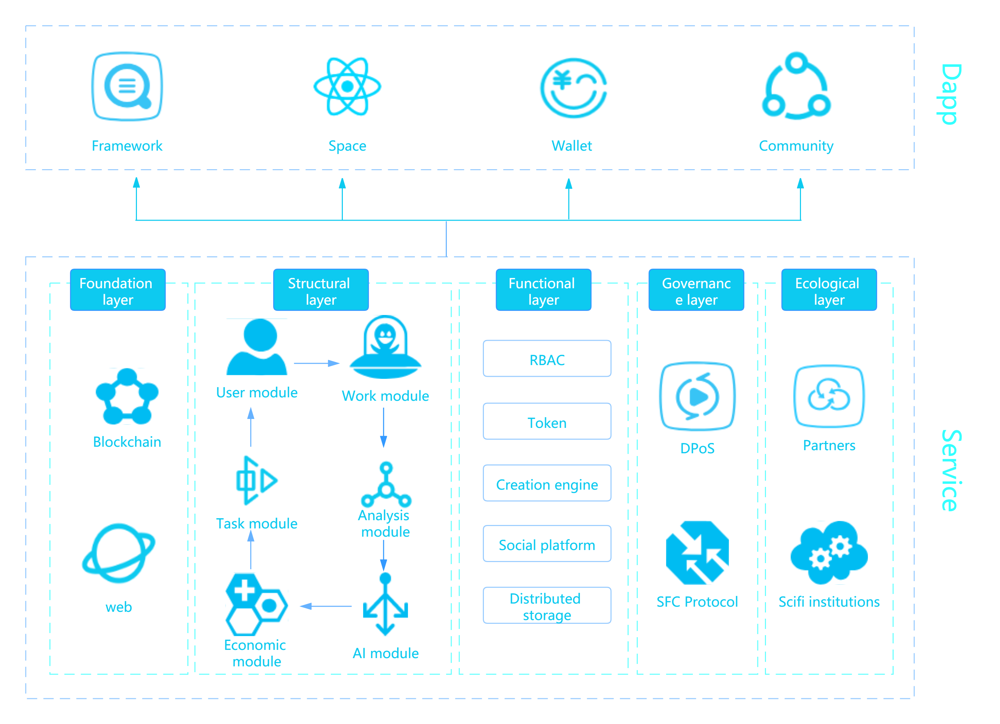
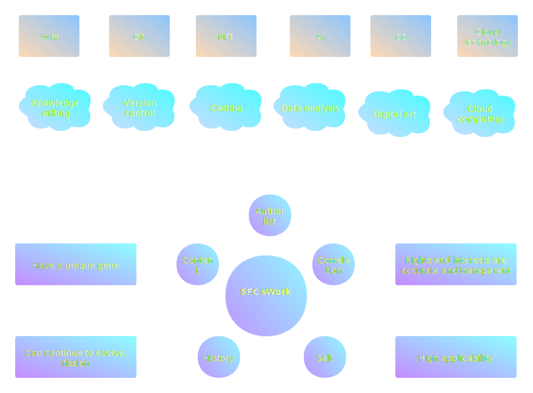
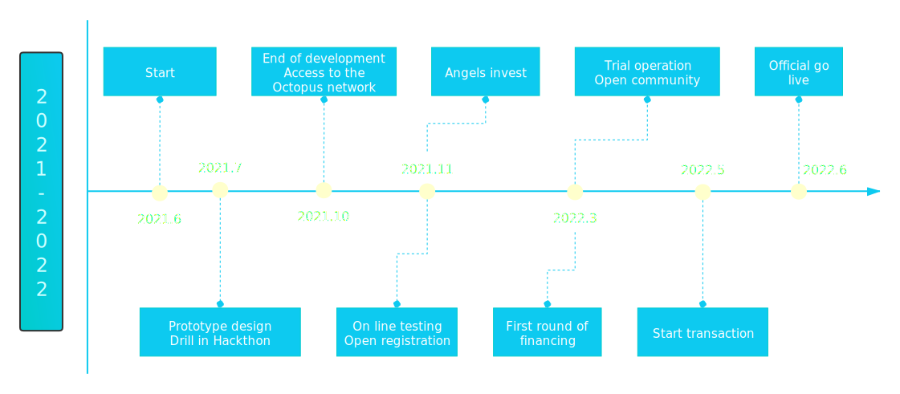

# 赛凡链白皮书

赛凡链Scifanchain是一个科幻产业区块链，一个充满活力的开源的科幻创意社区。它着眼于一个新的文明前景，这个文明视人类为一体，科学理性与道德人文和谐统一，谋求公正，彰显人的尊贵价值，推动未来文明演进。

赛凡链以Substrate为基础框架，提供一个分布式、开放包容、安全智慧的科幻创作应用链，为创作者和产业从业者提供链上存证、共识、驱动引擎和交易、激励、治理模式，创生并推动独具创意、面向未来的科幻创意产业繁荣发展。

赛凡链是一个专注于科幻产业的应用型区块链。Sci-fan-chain分别代表science（科学）、fantasy（幻想）和blockchain（区块链）。赛凡链的理念是重塑科幻产业生产关系，让科幻产业价值的创造更加高效，分配更加合理公平，其核心目标在于捕获科幻产业的价值，充分利用新思维、新技术和新的生态建设模式，使创作者、读者、投资者、传播者、运营者之间以前所未有的模式创造性地合作，促进这个产业的高速发展。

随着全球科技的突飞猛进，面向未来的科幻产业会呈现前所未有的繁荣。很多人都意识到，我们其实已经生活在一个科幻时代。科幻是一个高价值含量、非常有前景的产业。一直以来，科幻电影和文学作品在全球拥有庞大消费市场，近年来中国本土的科幻产业链发展得十分迅束 。中国人口众多，传统行业正在进入衰退，对新兴产业来说，这是良好的机会。人们对新事物怀有极大热情，社会的过剩资源在寻找新的领域，越来越多的目光向科幻产业聚焦。

赛凡链以最新区块链技术为基础，结合应用层和客户端，打造一个去中心化、开放包容、安全智慧的科幻创作应用链，为充满无限可能的科幻生态注入生机，开创数字艺术的新模式。

赛凡链服务于科幻产业，主要功能包括数字作品链上存证、IPFS分布存储、协同创作共识、CDE发展驱动引擎、NGL磋商治理模式等，简要概括如下：

以人的创造劳动为核心来计算价值，链上价值体现的是所有用户的真实创造价值，以区块链Token通证为基础打造作品创作、传播和应用的驱动引擎，为科幻产业注入澎湃动力；
革新科幻文学的艺术的创作、阅读和传播模式；
提供一个科学与想象结合的宇宙概念模型框架，为所有用户的协同创作奠定基础；
全面记录整个创作过程，构成独特的作品区块链基因图谱，使作品在流通中的价值可溯源追踪，科学分配给每个环节的参与者；
构建基于平衡寻优算法的现代磋商模式（优于议会投票与大众民主）治理社区，构建由共识驱动的发展生态。

科幻是一个有较高门槛的行业，它需要奇思妙想、先进的技术、多学科融合、不断创新。经过调研我们发现，在整个产业链中居于上游位置的优秀文本作品很稀缺，制约着整个产业的发展。所以在第一个阶段，我们的目标锚定于这一瓶颈，致力于发现、集结一批优秀的科幻作家和爱好者，建立起一个活跃的科幻社区。

## 特点

### 解化个人化写作的痛点

- 个人化写作效率低下
- 写作条件艰难，得不到支持
- 单枪匹马创作，没有协作。好的科幻作品需要多种专业背景知识，现今行业分工越来越细致，个人很难拥有足够的知识结构去完成宏大文明背景的作品，所以需要汇聚各方面人才进行协作。

### 使创作者分配合理科学

传统的创意作者在产业链中的地位尴尬，流量和知名度主导作者的收益，造成两极分化：知名作者收入颇丰，而普通作者在产业链条中无缘分羹，普通作者的积极性受到很大抑制。

区块链技术可以使创作者的劳动在链条中得到稳定。

### 结构与功能

赛凡链以Substrate框架为基础搭建，结构如下图：

## 驱动引擎：区块链技术

任何事物的发展，都需要动力。如果做一个事情有强大动力，那这件事就容易推进。

我们都知道，科幻文学作品的写作是一个不容易的事情，需要花费大量的精力，完成一个作品的周期很长，并且充满各种不确定性因素。在作品取得成功之前，作者孤军奋战，很少能得到帮助；在注重流量的、以中心化为特征的互联网中，很多有潜力的作品如果得不到精心包装，会被淹没于信息洪流中，也很难与它的读者相遇。作为一名科幻作者，我深切体会到，科幻作品从开始到完成，这个过程中间有很多价值的东西，在传统出版模式中，它们丝豪不被关注，这些价值通常被忽略和丢弃了。

赛凡链要把这些作品的价值全部捕获，让它们转变为相应的资源并释放能量，通过区块链的Token经济模型，使创作者在创作的早期阶段就能得到资金支持，使他们能专注于创作。我们通过区块链治理，重塑创作者、投资者、服务者、消费者的身份，建立共识，达成高效率的合作。

所以，赛凡链的首批用户是一批科幻作家、读者和支持者。作家在赛凡链创作作品，读者和支持者帮助作品的创作和流通，他们付出劳动，得到Token激励。赛凡链采用人的创作来替代算法挖矿，我们深信语言文字、科学和艺术、想象和思考、星空宇宙都饱含价值，而能把它们挖掘出来的是创作者，算法对此无能为力。赛凡链的Token经济建立在人的创造力和劳动的基础上，我们的一系列算法和协议都围绕着创造过程设计，以求合理地表达不同阶段作品的价值。简单来说，我们采用字数为参考来表达作品的数量价值，以品级、成熟度来表示作品的质量价值，数量价值由程序统计给出，而质量价值则由社区通过全员投票来评定。

听到这里，有朋友可能会产生疑问，这真的可行吗？怎么保证一个人不随意地复制大量垃圾文字恶意抢夺Token呢？怎么保证社区投票能公正反映一个作品的质量呢？

以上面的两个问题为例。我们为作品设计有时间线、遗忘曲线、成熟度、参与度、引用度等诸多属性，在这些属性的综合作用下，垃圾文字很快会进入警示性的红名单，红名单作品在一个期限内，可由任何其他作者修改以提升质量，Token会按某种比例让渡给修改者。如果到期没有提升到最低水准的话，Token会被没收并燃烧掉，情节恶劣的作者会被处罚。而作品的质量评级中，根据结果会计算出一个公允值，投票者的投票如果趋近该公允值，投票者就可以得到更多的Token奖励，反之则更少。长期、多次远离公允值的投票，会降低该投票人的公信力，进而影响到他投票的权重。我们认为评论、投票、打赏、转发传播等行为都具有价值，都能得到相应的小额Token激励，这样他们就有动力去为作品的质量提升作出贡献。这样，经过一次一次的迭代，好的作品的质量会不断提升，得到更多价值的绑定，而差作品所赚取的Token会被稀释、转移，甚至被燃烧失去价值。

这两个问题的解决方案表明了我们如何将区块链思维和技术应用在具体的场景中。在这些问题获得解决的前提下，我们可以让赛凡链更有趣。任何人都可以在赛凡链创作自己的故事，但不仅仅如此，我们有更宏伟的目标！赛凡链并不仅仅是一个去中心化的创作社区，一个科幻主题的、区块链化的写作平台。我们是一个与现实世界平行的宇宙，一个来自未来的世界，它本身足够科幻，这样才酷对吧？

赛凡链上所有作品的价值拥有进入现实世界的渠道。文字作品可以衍生出CG、3D模型、VR、影视作品，可以成为纸质出版物和电子出版物，可以采用订阅的方式直接面对读者在线发行，它们最终都会产生真实价值。当这个链逐渐发展成熟，它会成为整个科幻行业的一个基础设施，各种线下的公司、机构、从业人员，都可以将自己的劳动成果挂载到链上，届时赛凡链捕获的是全部行业的价值，而这些价值真正属于创造它的人，不被任何特权者、财阀或垄断者剥夺。

## 智慧创作辅助模型：数据化应用

在创作中，我们利用现代的数据处理技术对作品进行管理，进而支持创作。

协同创作模式在文学历史上曾是主流，只是它自然而然发生，没有被注意到。很多家喻户晓的英雄人物，都不是某一个创造者独立完成的，而是很多人共同参与的结果。赛凡链借助于互联网和区块链技术，将这一模式提炼出来。

写过长篇小说的作家，其实都应该知道，写小说绝对像搞工程，旷日持久，没日没夜劳作，所谓的才华、灵感只是偶尔来一下，大部分时间都像搬砖门一样码字。有各种各样的作品，有的以结构见长，有的擅于刻画心理，不一而足。写小说不是不需要合作，而是太需要了！

现代化的程序开发中，代码都是相互依赖的，不同的代码库相互引用，这是最自然不过的事，以github为代表的代码管理模式堪称合作的典范。但在文学创作领域没有这么先进的工具，作品之间相互依赖引用是罕见的。保守的做法应该被革新，作者A塑造了一个非常有趣的英雄人物，作者B想让这个人物出现在他的故事中，这样会给他的故事增色不少，同时，他的故事也是对该英雄人物的延伸和加工，如果处理得当，这是一个两全其美的事，何乐而不为呢？很少有作家这样做，其中很重要的一个原因是缺乏信任。

我们知道，区块链技术最重要的价值之一就是解决信任问题，我们设计了一套机制来鼓励合作，比如不只是简单地将Token与作品挂起钩来，而是力图让Token以各种方式促进作品的相互依赖、嵌入和引用，在所有的事务中，都通过Token进行奖励和惩罚，这使得Token不断流通，价值越来越被凸显出来。

就以上面两个作者来继续举例，作者B要使用作者A的人物，最有效的方式就是在他的作品中直接引入该人物，为此他需要支付给作者A一笔费用，作者A因此获益，而作者B的故事也拥有了英雄人物的基因，他为此拥有了对英雄人物命运的部分处理权限，如果两位作者共同努力，这个英雄人物的形象将在科幻世界里更加丰满，其价值会不断提升，有更多作者愿意引入这个英雄，最终，塑造这个英雄人物的是一个作者群，而不再是某一个人。这个作者群形成一个亚社区，他们以社区模式来对英雄人物进行治理。如果作者群治理不成功，英雄人物的影响力会受到减弱，其价值受损，这是所有的参与作者都不愿看到的，他们必须学会合作，提升自己融入社区的能力。

赛凡链在应用层，借鉴和引入了以下先进的思想、技术和模式：

Wiki：
Git：版本控制和协作；
NFT：铸造；
数据分析和人工智能：
社交：

我们让整个赛凡链的作品能够互相渗透、融合，构建出一个有完整世界观的宇宙，可以无穷无尽地演化。赛凡链是科幻文学创作上与互联网技术的独特创新，真正体现Web3.0的宏伟愿景。我们相信，在科幻与Web3.0谜一般的基因混合下，令人激动的、前所未有的新事物会被缔造出来。

## 概念框架：整合的艺术

在科幻作品的创作实践中，非常重要的一个问题是创作者需要花大量时间和精力去解决的，那就是宇宙观、世界观的构建。科幻作品与现实主义作品之间最大的一点不同，是科幻作品需要一个不同于现实世界的虚拟世界，而该虚拟世界需要通过科学的探索和想象来构建，并与现实世界产生映射。

赛凡链的概念框架设计出来，就是为了满足这一需求。它具有以下特性：

一个基本的结构，描绘了自洽的宇宙和世界图景，该图景足够宏大，有向外和向内两个维度，向外可以拓展到无限星空，而向内，则深入人类的精神世界，该概念框架提供了一个坚实的基础，基于该框架进行创作，会在艺术、科学、哲学、宗教上进行自然而然的、拥有相当深度和广度的对话、碰撞。
保持开放和灵活。框架不会限制创作者的想象力，完全可以进行打破，开启新的可能性，而你创造出的新概念，经过积淀和验证，可能会融入到框架中它的一部分。
概念与社会实在的关系。

赛凡链的概念框架，是在文学和艺术层面对内容进行概括和抽象的产物。

## 经济

## Scifan Token 分发目标

- 保证技术开发与运营稳定进行
- 鼓励作者创作
- 鼓励作者参与社区治理

## Scifan Token 经济

Scifan Token的经济总量是1亿。Scifan 把 80% 的 Token 分配给用户，团队保留10%的奖励，并使用10%的 Token 用于融资。

| 模块     | 比例 | 分发方法                                                     |
| -------- | ---- | ------------------------------------------------------------ |
| 挖矿     | 80%  | 1. 这部分Token主要与作品相对应，作品越多则解锁的Token越多。作者首先创作出作品，然后根据作品长度和质量进行定价，最后分发Token。2. 作品的定价由两部分构成：系统基础测评、社区质量评审。其中，系统基础测评占20%，核心指标是作品长度或字数；社区质量评审占80% ，核心指标是作品质量。3. 若作品涉及商业运作，则根据各作者拥有的Token分配商业收益。 4. 鼓励创作者参与社区评审和治理。 |
| 私募融资 | 10%  | 作为Scifan的开发经费。上线后解锁30%，初次解锁后每6个月解锁25%，最后6个月解锁20%。 |
| 团队奖励 | 10%  | 用于开发与运营团队的激励。这部分Token将在上线后解锁10%，初次解锁后每个月解锁5%。 |

## 社区治理

区块链为社区治理提供了很好的模式。

## 路线图

